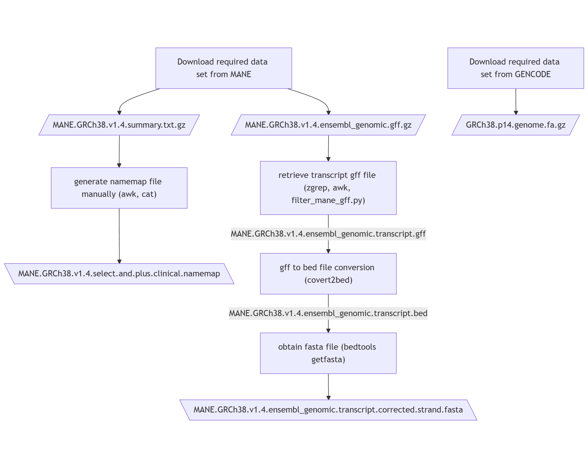
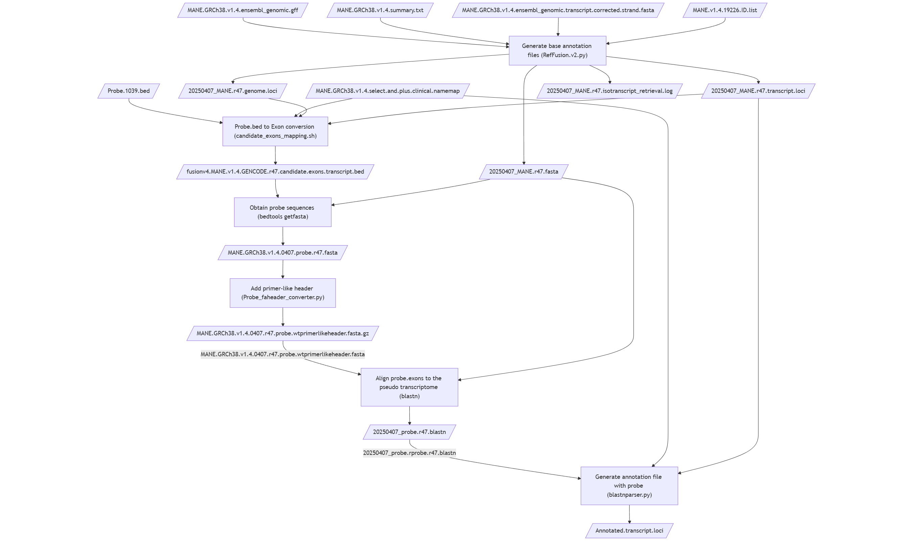
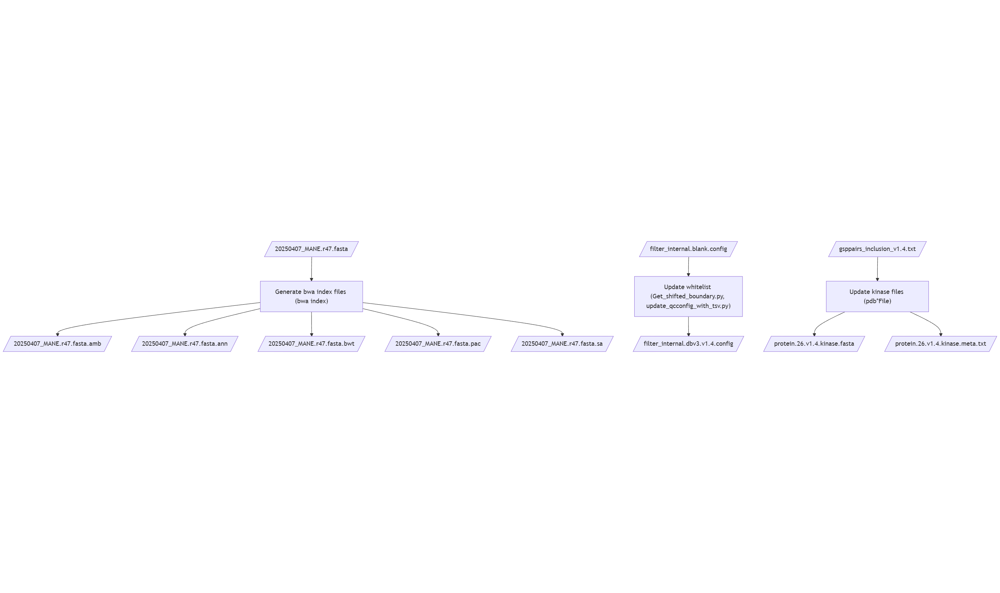

==============================================
Fusion V4-based workflow db files preparation
==============================================

-----------------
Purpose
-----------------

This document records how the Fusion V4 annotation files are prepared

----

-----------------
Repo
-----------------

- `Docker image construction for the commonly used fusion dev. tools <https://github.com/ACTGenomics/fusion_pipeline_env>`_

-----------------
Docker Image
-----------------

Stable version for the commonly used fusion dev. tools: `v0.6 <https://hub.docker.com/repository/docker/actgenomics/fusion_dev/general>`_

-----------------
Others materials
-----------------

- DB preparation summary (MANE v1.4): `[Fusion v5] preferred transcriptome fusion v4 -> v5 db update (MANE v0.95 -> v1.4) <https://actg.atlassian.net/browse/ABIE-1012>`_
- See the detailed db-v3.1 documentation here: `My PDF Guide <_static/Fusion_db_prep.steps_db-v3.1.pdf>`_

----

-----------------
Source Files
-----------------

These files are the source (input) files for fusion V4 db construction. 

- **MANE v1.4 DB**: 
    - ``MANE.GRCh38.v1.4.summary.txt.gz``
    - ``MANE.GRCh38.v1.4.ensembl_genomic.gff.gz``

- **Genome sequence, Grch38, GENCODE-r47**
    - ``GRCh38.p14.genome.fa.gz``

- **Probe information file provided by AD team**
    - ``ACTFusionv5_target-region_PartAB_individual_1039.bed``

- **Kinase files (manually curated)**
    - ``protein.26.v1.4.kinase.fasta``
    - ``protein.26.v1.4.kinase.meta.txt``

- **White list (gsp pair/probe pair)**
    - ``gsppairs_inclusion_v1.4.txt``
    - ``filter_internal.QC9.0.mgsp.qcr.0.5.blank.config``

.. code-block:: console

    # Local file list (directories)
    /mnt/RD_Develop/sandyteng/ACTFusionV5/db_fusionv5/mane_v1.4/OpenDB_MANE_human_v1.4/release_1.4/MANE.GRCh38.v1.4.summary.txt.gz
    /mnt/RD_Develop/sandyteng/ACTFusionV5/db_fusionv5/mane_v1.4/OpenDB_MANE_human_v1.4/release_1.4/MANE.GRCh38.v1.4.ensembl_genomic.gff.gz

    /mnt/RD_Develop/sandyteng/ACTFusionV5/db_fusionv5/gencode_v47/OpenDB_GENCODE_human_r47/GRCh38.p14.genome.fa.gz

    /mnt/RD_Develop/sandyteng/ACTFusionV5/db_fusionv5/captureprobe_250401/ACTFusionv5_target-region_PartAB_individual_1039.bed

    /mnt/RD_Develop/sandyteng/ACTFusionV5/db_fusionv5/v1.4_inputfiles/protein.26.v1.4.kinase.fasta
    /mnt/RD_Develop/sandyteng/ACTFusionV5/db_fusionv5/v1.4_inputfiles/protein.26.v1.4.kinase.meta.txt

    /mnt/RD_Develop/sandyteng/ACTFusionV5/test/20250423_fusionv42v5_whitelist_gsppair/data/gsppairs_inclusion_v1.4.txt
    /mnt/RD_Develop/sandyteng/ACTFusionV5/test/20250423_fusionv42v5_whitelist_gsppair/testconfigs/filter_internal.QC9.0.mgsp.qcr.0.5.blank.config

----

Workflows
~~~~~~~~~~~~~~

    
-----

-----------------
Config Files
-----------------
- **Config file for v1.4 MANE Select transcriptome**
    - ``fusion_multi_localdocker.v9.20241125.v0.23.0_v1.4.MANE.transcriptome.v3-1.config``

- **Config file for v0.95 MANE Select transcriptome (== fusion v5 pipeline v0.1 config file for fusion v4-based workflow)**
    - ``fusion_multi_localdocker.v9.20241125.v0.23.0.config``

.. code-block:: console

    # Local file list (directories)
    /mnt/RD_Develop/sandyteng/ACTFusionV5/nextflow/repo_code_v1.4_dbtest_0414.2025/dockerconfigs/fusion_multi_localdocker.v9.20241125.v0.23.0_v1.4.MANE.transcriptome.v3-1.config
    /mnt/RD_Develop/sandyteng/ACTFusionV5/nextflow/repo_code_v1.4_dbtest_0414.2025/dockerconfigs/fusion_multi_localdocker.v9.20241125.v0.23.0.config

----

--------------------
Conclusion
--------------------

This completes the instructions for Fusion V4-based db construction.